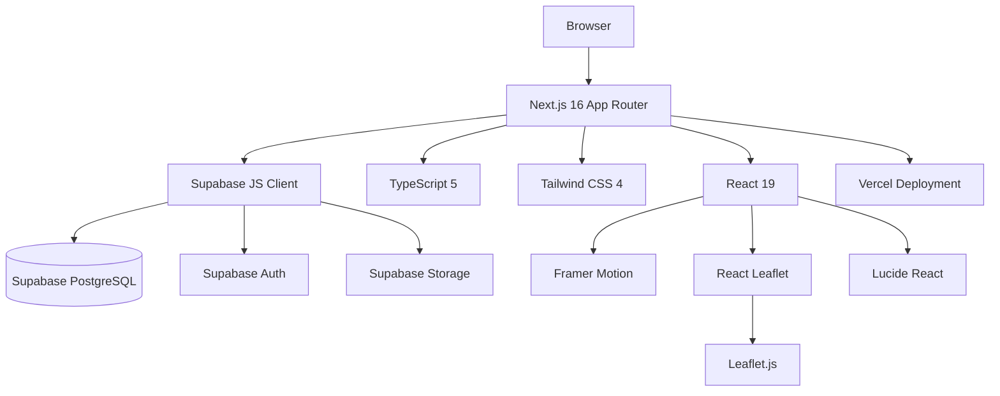

# 03 — Tech Stack

## Ringkasan

Website GKPI Sinode dibangun dengan tumpukan teknologi modern yang mengutamakan performa, pengembangan yang cepat, dan kemudahan pemeliharaan jangka panjang.

---

## Daftar Teknologi

### Framework Utama

#### Next.js 16 (App Router)
- **Versi**: `^16.2.10`
- **Alasan dipilih**: Next.js menyediakan Server-Side Rendering (SSR), Static Site Generation (SSG), dan Server Components secara built-in. App Router memungkinkan pengambilan data langsung di komponen server (RSC), sehingga halaman publik seperti Beranda dan Publikasi tidak perlu mengambil data di sisi klien.
- **Fitur yang digunakan**: App Router, Server Components, Client Components (`"use client"`), Dynamic Imports, `generateMetadata` untuk SEO, `sitemap.ts`, `robots.ts`

#### React 19 + React DOM 19
- **Versi**: `19.2.4`
- **Alasan dipilih**: Versi terbaru React yang diperlukan oleh Next.js 16.

---

### Bahasa Pemrograman

#### TypeScript 5
- **Versi**: `^5`
- **Alasan dipilih**: TypeScript memberikan type-safety di seluruh codebase, mengurangi bug runtime, dan meningkatkan pengalaman developer (IntelliSense, autocomplete). Semua file dalam proyek ini menggunakan ekstensi `.ts` dan `.tsx`.

---

### Styling

#### Tailwind CSS 4
- **Versi**: `^4`
- **Alasan dipilih**: Tailwind CSS 4 memperkenalkan sistem `@theme` baru yang memungkinkan pendefinisian design token langsung di CSS (tanpa `tailwind.config.js`). Semua token warna, font, dan animasi didefinisikan di `src/app/globals.css` menggunakan blok `@theme`.
- **PostCSS Plugin**: `@tailwindcss/postcss ^4`

---

### Backend & Database

#### Supabase
- **Paket**: `@supabase/supabase-js ^2.110.0`
- **Layanan yang digunakan**:
  - **PostgreSQL Database**: Tabel untuk `publications`, `products`, `pengurus_seksi`, `pengurus_grup`, `pengurus_anggota`, `jemaat`, `financial_reports`, `contact_messages`
  - **Supabase Auth**: Login berbasis email + password untuk admin panel
  - **Supabase Storage**: Bucket untuk menyimpan gambar (`publications`, `pengurus`, `jemaat-photos`) dan dokumen (`financial-reports`)
  - **Row Level Security (RLS)**: Policies untuk memproteksi operasi write hanya untuk pengguna terautentikasi
- **Client**: Satu instance Supabase client (`src/lib/supabase.ts`) dipakai di seluruh aplikasi, baik server maupun client component.

---

### Animasi

#### Framer Motion
- **Versi**: `^12.38.0`
- **Digunakan di**: Komponen `ScrollReveal.tsx` untuk animasi scroll reveal (fade-in + slide-up) pada elemen yang masuk ke viewport.

---

### Peta Interaktif

#### Leaflet + React Leaflet + React Leaflet Cluster
- **Versi**:
  - `leaflet: ^1.9.4`
  - `react-leaflet: ^5.0.0`
  - `react-leaflet-cluster: ^4.1.3`
  - `@types/leaflet: ^1.9.21`
- **Digunakan di**: Halaman Wilayah & Resort (`/wilayah-resort`) untuk menampilkan peta interaktif semua jemaat GKPI.
- **Catatan penting**: Leaflet menggunakan API browser (`window`, `document`). Karena itu, komponen `MapView.tsx` di-import menggunakan `dynamic(() => import("./MapView"), { ssr: false })` untuk menonaktifkan Server-Side Rendering.

---

### Kompresi Gambar

#### browser-image-compression
- **Versi**: `^2.0.2`
- **Digunakan di**: `src/lib/image-compress.ts` sebelum upload gambar ke Supabase Storage, untuk mengurangi ukuran file dan menghemat bandwidth. Terdapat preset kompresi untuk `publikasi`, `toko`, `pengurus`, dan `logo`.

---

### Ikon

#### Lucide React
- **Versi**: `^0.460.0`
- **Digunakan di**: Seluruh UI. Lucide menyediakan ikon SVG yang konsisten dan ringan.

---

### Deployment

#### Vercel
- **URL Produksi**: `https://sinodegkpi.vercel.app`
- **Alasan dipilih**: Vercel adalah platform deployment resmi dari tim Next.js, menawarkan zero-config deployment, CDN global, dan integrasi sempurna dengan Next.js.

---

## Diagram Ketergantungan Teknologi

---

## Versi Node & npm

| Tool | Versi Minimum |
|---|---|
| Node.js | `>= 18.x` |
| npm | `>= 9.x` |

---

## Catatan Kompatibilitas

- Proyek ini menggunakan **postcss override** (`"overrides": { "postcss": "^8.5.10" }`) di `package.json` untuk memastikan kompatibilitas antara `@tailwindcss/postcss` dan versi PostCSS yang digunakan Next.js.
- Leaflet harus selalu di-import secara **dinamis dengan `ssr: false`** karena ketergantungannya pada browser API.
