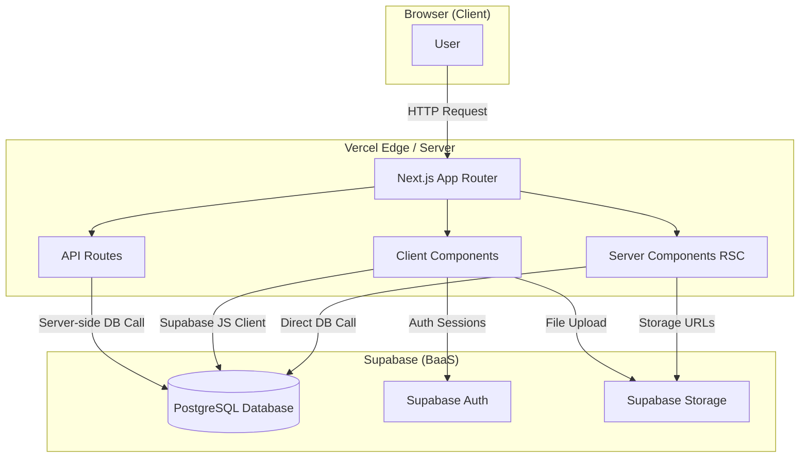
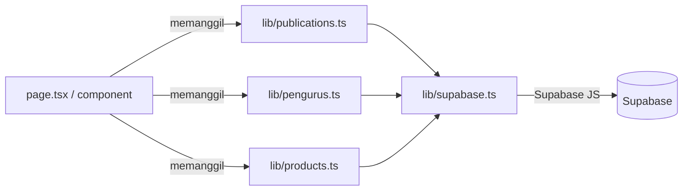
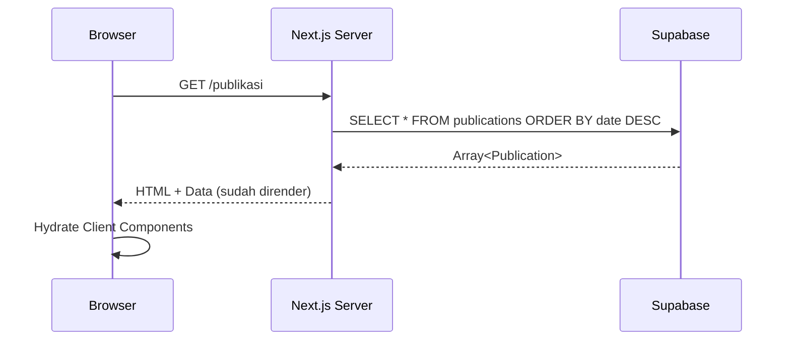
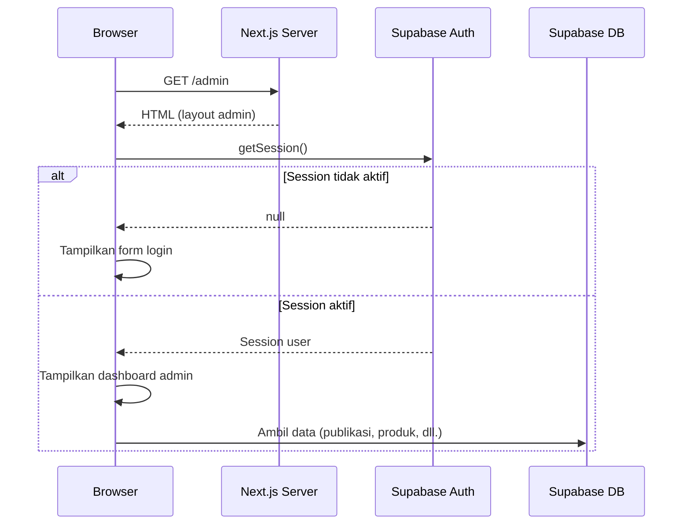

# 05 — Arsitektur

## Gambaran Arsitektur Keseluruhan

Website GKPI Sinode menggunakan arsitektur **Next.js App Router** dengan pola **Server-First**, artinya komponen secara default dirender di server (React Server Components / RSC), dan komponen yang membutuhkan interaktivitas browser dideklarasikan sebagai Client Component menggunakan `"use client"`.

---

## Diagram Arsitektur Utama

---

## Lapisan Aplikasi

### 1. Lapisan Presentasi (UI Layer)

Terdiri dari komponen React di folder `src/components/`. Komponen dibagi menjadi dua jenis:

**Server Components (default):**
- Tidak memiliki state atau event handler browser
- Dapat langsung mengambil data dari Supabase tanpa API tambahan
- Dirender di server, hasilnya dikirim sebagai HTML ke browser
- Contoh: `Section.tsx`, `Card.tsx`, `Footer.tsx`, `ResortHero.tsx`

**Client Components (`"use client"`):**
- Memiliki state (`useState`), efek (`useEffect`), atau event handler
- Dirender di sisi klien setelah HTML awal diterima
- Contoh: `Navbar.tsx`, `Hero.tsx`, `InfoSlideshow.tsx`, `ScrollReveal.tsx`, `MapExplorer.tsx`, `AdminSidebar.tsx`

---

### 2. Lapisan Halaman (Page Layer)

Terdiri dari file `page.tsx` di dalam `src/app/`. Halaman dapat bersifat:

**Async Server Pages:**
- Mengambil data langsung dengan `await` di dalam komponen
- Data sudah siap saat HTML dikirim ke browser
- Contoh: `src/app/page.tsx` (Beranda), `src/app/pengurus/page.tsx`

**Client Pages:**
- Menggunakan hook dan state untuk pengambilan data di sisi klien
- Contoh: Beberapa halaman admin

---

### 3. Lapisan Data (Data Layer)

Terdiri dari file di `src/lib/` dan `src/data/`. Semua interaksi dengan Supabase dienkapsulasi di sini.

**Pola yang digunakan:**
- Setiap domain memiliki file lib-nya sendiri (`publications.ts`, `products.ts`, dll.)
- Setiap file mengekspor fungsi-fungsi async yang mengembalikan typed data
- Satu Supabase client dipakai bersama (`src/lib/supabase.ts`)

---

### 4. Lapisan API (API Routes)

Terdiri dari `route.ts` di dalam `src/app/api/`. Saat ini hanya digunakan untuk fitur Share Files:

| Route | Metode | Fungsi |
|---|---|---|
| `/api/sharefile/verify` | POST | Verifikasi akses (email/kode) ke folder share |
| `/api/sharefile/download` | GET | Download file dari Supabase Storage dengan otorisasi server |

API Routes dijalankan di server, sehingga dapat menggunakan `SUPABASE_SERVICE_ROLE_KEY` (yang tidak boleh terekspos ke browser).

---

## Aliran Data: Halaman Publik

---

## Aliran Data: Admin Panel

---

## Autentikasi Admin

Sistem autentikasi menggunakan **Supabase Auth** dengan metode email + password.

- **Auth Gate** berada di `src/app/admin/layout.tsx`
- Saat pertama kali load, `getSession()` dipanggil untuk mengecek sesi aktif
- Jika tidak ada sesi, form login ditampilkan
- Setelah login berhasil, `onAuthStateChange` memperbarui state otomatis
- Session disimpan di `localStorage` oleh Supabase JS Client

---

## Pola Arsitektur yang Digunakan

### 1. Single Supabase Client
Satu instance `supabase` dibuat di `src/lib/supabase.ts` dan diimport ke mana pun dibutuhkan. Ini menghindari pembuatan koneksi ganda.

### 2. Co-located Types
Tipe TypeScript didefinisikan di file yang berhubungan langsung (misalnya, tipe `Publication` di `lib/types.ts`, tipe `Jemaat` di `data/jemaat.ts`).

### 3. Domain-Separated Libraries
Setiap domain bisnis memiliki file lib-nya sendiri, membuat kode mudah dicari dan dirawat.

### 4. Dynamic Import untuk Leaflet
Karena Leaflet bergantung pada API browser, `MapView.tsx` selalu di-import secara dinamis dengan `ssr: false` untuk menghindari error saat server rendering.

### 5. Image Compression Before Upload
Semua gambar dikompres menggunakan `browser-image-compression` sebelum diupload ke Supabase Storage, untuk menghemat bandwidth dan storage.
