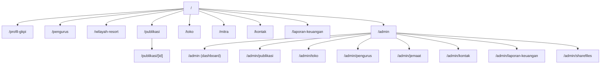

# 07 — Routing

## Sistem Routing

Proyek ini menggunakan **Next.js App Router** yang berbasis filesystem. Setiap folder dengan file `page.tsx` di dalamnya otomatis menjadi sebuah route URL.

---

## Peta Routing Lengkap

### Halaman Publik

| URL | File | Deskripsi |
|---|---|---|
| `/` | `src/app/page.tsx` | Beranda |
| `/profil-gkpi` | `src/app/profil-gkpi/page.tsx` | Profil GKPI |
| `/pengurus` | `src/app/pengurus/page.tsx` | Struktur pengurus |
| `/wilayah-resort` | `src/app/wilayah-resort/page.tsx` | Peta & resort jemaat |
| `/publikasi` | `src/app/publikasi/page.tsx` | Daftar publikasi |
| `/publikasi/[id]` | `src/app/publikasi/[id]/page.tsx` | Detail publikasi |
| `/toko` | `src/app/toko/page.tsx` | Toko produk GKPI |
| `/mitra` | `src/app/mitra/page.tsx` | Mitra pelayanan |
| `/kontak` | `src/app/kontak/page.tsx` | Kontak |
| `/laporan-keuangan` | `src/app/laporan-keuangan/page.tsx` | Laporan keuangan |
| `/info` | `src/app/info/page.tsx` | Halaman info |
| `/gkpi` | `src/app/gkpi/page.tsx` | Route alias/legacy |
| `/tentang-gkpi` | `src/app/tentang-gkpi/page.tsx` | Tentang GKPI |

### Admin Panel

| URL | File | Deskripsi |
|---|---|---|
| `/admin` | `src/app/admin/page.tsx` | Dashboard admin |
| `/admin/publikasi` | `src/app/admin/publikasi/page.tsx` | Kelola publikasi |
| `/admin/toko` | `src/app/admin/toko/page.tsx` | Kelola produk toko |
| `/admin/pengurus` | `src/app/admin/pengurus/page.tsx` | Kelola pengurus |
| `/admin/jemaat` | `src/app/admin/jemaat/page.tsx` | Kelola jemaat |
| `/admin/kontak` | `src/app/admin/kontak/page.tsx` | Kelola pesan masuk |
| `/admin/laporan-keuangan` | `src/app/admin/laporan-keuangan/page.tsx` | Kelola laporan keuangan |
| `/admin/sharefiles` | `src/app/admin/sharefiles/page.tsx` | Kelola folder berbagi |

### API Routes

| URL | File | Metode | Deskripsi |
|---|---|---|---|
| `/api/sharefile/verify` | `src/app/api/sharefile/verify/route.ts` | POST | Verifikasi akses ke folder share |
| `/api/sharefile/download` | `src/app/api/sharefile/download/route.ts` | GET | Unduh file dari Supabase Storage |

### File Khusus Next.js

| URL | File | Deskripsi |
|---|---|---|
| `/sitemap.xml` | `src/app/sitemap.ts` | Peta situs (auto-generate) |
| `/robots.txt` | `src/app/robots.ts` | Instruksi crawler (auto-generate) |
| `/icon.png` | `src/app/icon.png` | Favicon |

---

## Diagram Routing



---

## Layout & Nested Routing

Next.js App Router mendukung layout bersarang (nested layouts). Berikut layout yang ada:

### Root Layout (`src/app/layout.tsx`)
- Diterapkan ke **semua halaman**
- Mengatur: `<html lang="id">`, metadata global (title, OG, Twitter), font, dan `<body>` class global

### Admin Layout (`src/app/admin/layout.tsx`)
- Diterapkan ke semua halaman di bawah `/admin`
- Fungsi utama: **Auth Gate** (menampilkan form login jika tidak ada sesi) + Sidebar + Header admin

---

## Navigasi Publik (Navbar)

Navbar di `src/components/Navbar.tsx` mendefinisikan link navigasi sebagai array:

```typescript
const navLinks = [
  { name: "Beranda",             href: "/" },
  { name: "Profil GKPI",        href: "/profil-gkpi" },
  { name: "Pengurus",            href: "/pengurus" },
  { name: "Resort dan Wilayah",  href: "/wilayah-resort" },
  { name: "Publikasi",           href: "/publikasi" },
  { name: "Mitra",               href: "/mitra" },
  { name: "Toko",                href: "/toko" },
  { name: "Laporan Keuangan",    href: "/laporan-keuangan" },
  { name: "Kontak",              href: "/kontak" },
];
```

---

## Parameter URL yang Digunakan

Beberapa halaman menggunakan query parameter URL untuk menyimpan state:

| Halaman | Parameter | Contoh | Keterangan |
|---|---|---|---|
| `/wilayah-resort` | `?search=` | `?search=siantar` | Filter pencarian nama/kota/pendeta |
| `/wilayah-resort` | `?city=` | `?city=Medan` | Filter kota aktif |
| `/admin/publikasi` | `?tab=form` | `/admin/publikasi?tab=form` | Buka tab form tambah publikasi |
| `/admin/publikasi` | `?edit=[id]` | `/admin/publikasi?edit=5` | Buka form edit publikasi dengan id tertentu |
| `/admin/toko` | `?tab=form` | `/admin/toko?tab=form` | Buka tab form tambah produk |
| `/admin/toko` | `?edit=[id]` | `/admin/toko?edit=3` | Buka form edit produk dengan id tertentu |

---

## Halaman dengan Dynamic Route

### `/publikasi/[id]`

- `[id]` adalah ID numerik publikasi dari Supabase
- Server Component: mengambil data dengan `getPublicationById(id)` lalu merender halaman detail
- Mendukung `generateMetadata` untuk SEO dinamis per publikasi

---

## Halaman yang Memerlukan Autentikasi

Semua halaman di bawah `/admin` dilindungi oleh **Admin Layout** yang memeriksa sesi Supabase Auth. Jika tidak ada sesi aktif, pengguna akan melihat form login (bukan redirect, melainkan render kondisional di layout yang sama).
